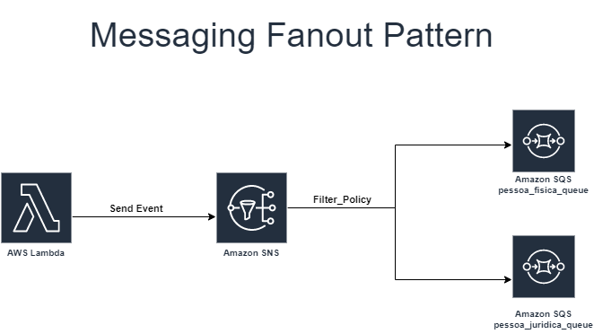
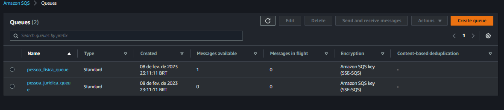
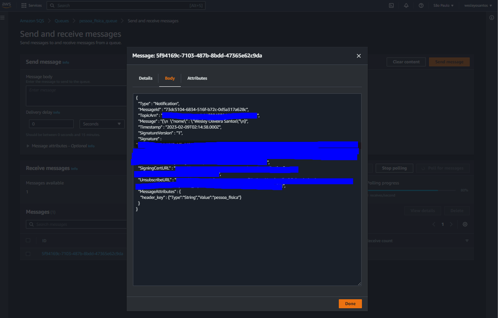

<div align="center">

# 📨 Messaging Fanout Pattern


Uma prova de conceito (POC) demonstrando a implementação do padrão Messaging Fanout utilizando AWS SNS e SQS com Terraform.

[Sobre](#-sobre) •
[Arquitetura](#-arquitetura) •
[Tecnologias](#-tecnologias) •
[Como Usar](#-como-usar) •
[Exemplos](#-exemplos) •
[Autor](#-autor)

</div>

---

## 📋 Sobre

O **Messaging Fanout Pattern** é um padrão de mensageria que permite a transmissão de mensagens de um produtor para múltiplos consumidores de forma desacoplada e escalável.

Este projeto implementa o padrão utilizando serviços gerenciados da AWS:
- **Amazon SNS** (Simple Notification Service) como publisher
- **Amazon SQS** (Simple Queue Service) como consumer
- **Filter Policies** para roteamento inteligente de mensagens

### 🎯 Casos de Uso

- Notificações para múltiplos sistemas
- Processamento paralelo de eventos
- Integração entre microserviços
- Event-driven architecture

---

## 🏗 Arquitetura



### Fluxo de Mensagens

1. **Publisher**:  Aplicação publica mensagem no tópico SNS
2. **Filter Policy**:  SNS filtra mensagens baseado em atributos
3. **Subscribers**: Mensagens são distribuídas para filas SQS específicas
4. **Consumers**:  Aplicações consomem mensagens das filas de forma independente

---

## 🚀 Tecnologias

- **[Terraform](https://www.terraform.io/)** - Infrastructure as Code
- **[AWS SNS](https://aws.amazon.com/sns/)** - Simple Notification Service
- **[AWS SQS](https://aws.amazon.com/sqs/)** - Simple Queue Service
- **[HCL](https://github.com/hashicorp/hcl)** - HashiCorp Configuration Language

---

## 💻 Como Usar

### Pré-requisitos

- AWS CLI configurado
- Terraform >= 1.0
- Credenciais AWS com permissões para SNS e SQS

### Instalação

```bash
# Clone o repositório
git clone https://github.com/wesleyosantos91/messaging-fanout-pattern.git

# Entre no diretório
cd messaging-fanout-pattern

# Inicialize o Terraform
terraform init

# Valide a configuração
terraform validate

# Planeje a infraestrutura
terraform plan

# Aplique as mudanças
terraform apply
```

### Destruir Infraestrutura

```bash
terraform destroy
```

---

## 📝 Exemplos

### Publicando uma Mensagem no SNS

1.  Acesse o console da AWS SNS
2. Selecione o tópico criado
3. Clique em "Publish message"
4. Adicione o corpo da mensagem e os **Message attributes** conforme definido na `filter_policy`

**Exemplo de Message Attributes:**
```json
{
  "tipo_pessoa": {
    "DataType": "String",
    "StringValue": "FISICA"
  }
}
```


### Visualizando Mensagem na Fila SQS

Após a publicação, a mensagem é roteada para a fila correspondente baseado nos filtros: 



### Consumindo a Mensagem

A aplicação consome a mensagem da fila SQS de forma assíncrona:



---

## 📚 Fundamentos Teóricos

> **Fan-out** é um padrão de mensagens onde as mensagens são transmitidas de um para muitos. Um exemplo básico desse padrão pode ser visto na funcionalidade de um sistema de mensagens Publish/Subscribe (Pub/Sub).

### Vantagens do Padrão

- ✅ **Desacoplamento**: Produtores e consumidores não precisam conhecer uns aos outros
- ✅ **Escalabilidade**: Adicione novos consumidores sem modificar o produtor
- ✅ **Resiliência**: Falhas em um consumidor não afetam outros
- ✅ **Flexibilidade**: Filtragem de mensagens por atributos

---

## 👨‍💻 Autor

<table>
  <tr>
    <td align="center">
      <a href="https://github.com/wesleyosantos91">
        <br>
        <sub>
          <b>Wesley Oliveira Santos</b>
        </sub>
      </a>
    </td>
  </tr>
</table>

---

## 📄 Licença

Este projeto está sob a licença MIT.  Veja o arquivo [LICENSE](LICENSE) para mais detalhes.

---

<div align="center">
  
⭐ Se este projeto foi útil, considere dar uma estrela! 

Feito com ❤️ por [Wesley Oliveira Santos](https://github.com/wesleyosantos91)

</div>
